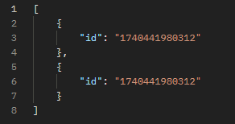
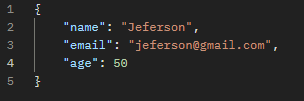
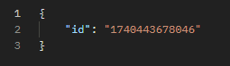
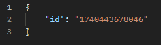
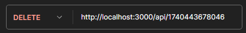
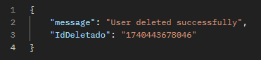

# Users Api 👤

## Rotas
### GET /
Retorna o ID de todos os usuários

#### Cabeçalho HTTP da Requisição

<li> Postman-Token: "calculated when request is sent"
<li> Host: localhost:3000
<li> User-Agent: PostmanRuntime/7.43.0
<li> Accept: */*
<li> Accept-Encoding: 
gzip, deflate, br
<li> Connection: keep-alive

#### Cabeçalhos HTTP da resposta
<li> X-Powered-By: Express
<li> Access-Control-Allow-Origin: *
<li> Content-Type: application/json; charset=utf-8
<li> Content-Length: 47
<li> ETag: W/"2f-hXcyr/zHmgx7hPzBaidK4kE5Y6U"
<li> Date: Tue, 25 Feb 2025 00:10:55 GMT
<li> Connection: keep-alive
<li> Keep-Alive: timeout=5

#### Corpo da resposta (JSON)

### POST /
Adiciona um usuário

#### Cabeçalho HTTP da Requisição

<li> Postman-Token: "calculated when request is sent"
<li> Content-Type: application/json
<li> Content-Length: "calculated when request is sent"
<li> Host: localhost:3000
<li> User-Agent: PostmanRuntime/7.43.0
<li> Accept: */*
<li> Accept-Encoding: 
gzip, deflate, br
<li> Connection: keep-alive

#### Corpo da requisição (JSON)

#### Cabeçalhos HTTP da resposta
<li> X-Powered-By: Express
<li> Access-Control-Allow-Origin: *
<li> Content-Type: application/json; charset=utf-8
<li> Content-Length: 22
<li> ETag: W/"16-v2pifaxdY8VY8BxEhlKDBU/OevQ"
<li> Date: Tue, 25 Feb 2025 00:34:38 GMT
<li> Connection: keep-alive
<li> Keep-Alive: timeout=5

#### Corpo da resposta (JSON)

### GET /:id
Busca o usuário por Id

#### Cabeçalho HTTP da Requisição

<li> Postman-Token: "calculated when request is sent"
<li> Host: localhost:3000
<li> User-Agent: PostmanRuntime/7.43.0
<li> Accept: */*
<li> Accept-Encoding: 
gzip, deflate, br
<li> Connection: keep-alive

#### Corpo da requisição (JSON)

#### Cabeçalhos HTTP da resposta
<li> X-Powered-By: Express
<li> Access-Control-Allow-Origin: *
<li> Content-Type: application/json; charset=utf-8
<li> Content-Length: 22
<li> ETag: W/"16-v2pifaxdY8VY8BxEhlKDBU/OevQ"
<li> Date: Tue, 25 Feb 2025 00:42:55 GMT
<li> Connection: keep-alive
<li> Keep-Alive: timeout=5

#### Corpo da resposta (JSON)

### DELETE /:id
Busca o usuário por Id

#### Cabeçalho HTTP da Requisição

<li> Postman-Token: "calculated when request is sent"
<li> Host: localhost:3000
<li> User-Agent: PostmanRuntime/7.43.0
<li> Accept: */*
<li> Accept-Encoding: 
gzip, deflate, br
<li> Connection: keep-alive

#### Corpo da requisição (JSON)

#### Cabeçalhos HTTP da resposta
<li> X-Powered-By: Express
<li> Access-Control-Allow-Origin: *
<li> Content-Type: application/json; charset=utf-8
<li> Content-Length: 68
<li> ETag: W/"44-VkmWWx5aRsmNVzgU9O2kj99ZyfE"
<li> Date: Tue, 25 Feb 2025 00:48:04 GMT
<li> Connection: keep-alive
<li> Keep-Alive: timeout=5

#### Corpo da resposta (JSON)
